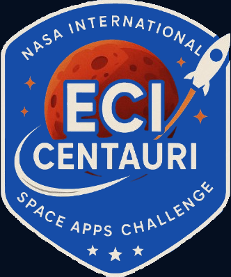

# 🌌 Exoplanet Hunter AI - Frontend

<!-- Logo placeholder -->
<div align="center">
  
</div>

<div align="center">


</div>

---

## 📋 **Table of Contents**

- [Overview](#-overview)
- [Features](#-features)
- [Tech Stack](#-tech-stack)
- [Architecture](#-architecture)
- [Prerequisites](#-prerequisites)
- [Installation](#-installation)
- [Configuration](#-configuration)
- [Running the Application](#-running-the-application)
- [Building for Production](#-building-for-production)
- [Project Structure](#-project-structure)
- [Component Documentation](#-component-documentation)
- [Customization](#-customization)
- [Development Team](#-development-team)
- [License](#-license)

---

## 🌟 **Overview**

**Exoplanet Hunter AI** is a modern web application developed for the [NASA International Space Apps Challenge 2025](https://www.spaceappschallenge.org/2025/challenges/a-world-away-hunting-for-exoplanets-with-ai/). This interactive frontend provides an intuitive interface for astronomers and citizen scientists to **analyze transit light curves**, **detect exoplanets using AI models**, and **explore astronomical data** in real-time.

The application features a **NASA-themed dark blue design**, **responsive UI**, and seamless integration with the backend API for machine learning predictions.

---

## ✨ **Features**

### 🔐 **Authentication System**
- **User registration** with profile photo upload
- **Login system** with JWT token management
- **Continue without account** option for guest users
- **Password recovery** flow
- **Secure token storage** in localStorage

### 🎨 **User Interface**
- **NASA-inspired dark blue theme** (#0b3d91 - official NASA blue)
- **Responsive design** for desktop, tablet, and mobile
- **Animated star background** for immersive space experience
- **Interactive transit light curves** visualization
- **Real-time AI prediction** display with confidence scores

### 👤 **User Profile Management**
- **Personal dashboard** with analysis history
- **Achievement system** tracking discoveries
- **Query history** with filtering and export
- **Profile customization** with photo upload
- **Global leaderboard** rankings

### 🤖 **AI Integration**
- **CNN Model**: Convolutional Neural Network specifically trained for exoplanet detection
- **Real-time predictions** with confidence metrics
- **Model performance visualization** with accuracy, loss, and metrics charts
- **FITS file upload support** with data source selection (TESS, Kepler, K2)
- **Analysis export** in CSV and XLSX formats

### 📊 **Data Visualization**
- **Transit light curve** plotting with real-time animation
- **3D exoplanet models** viewer with 5 different GLTF models
  - Auto-rotation every 20 seconds between models
  - Manual model selection with navigation buttons
  - Interactive camera controls and smooth transitions
  - Optimized zoom levels for each model
- **Model performance metrics** (accuracy, precision, recall, F1-score)
- **Statistical summaries** of analysis results
- **Interactive charts** with hover details and tooltips

### 🌍 **NASA API Integration**
- **NASA WMTS (Web Map Tile Service)** for lunar imagery
  - Real-time Moon surface visualization
  - Tile-based map rendering
  - Zoom and pan controls
  - Environment variable configuration for API keys

### � **Data Import/Export**
- **FITS file upload** with validation (.fits format only)
- **Data source selection**: TESS, Kepler, K2 telescope missions
- **Export formats**: CSV (data analysis) and XLSX (Excel spreadsheets)
- **Format preview** with detailed descriptions

### �📰 **Community & Sharing Features**
- **News panel** with latest exoplanet discoveries
- **Educational facts carousel** with 11 comprehensive exoplanet facts
- **Share discoveries** with dual functionality:
  - Copy-to-clipboard for instant link sharing
  - **QR Code generation** with unique session IDs for each user
  - Download QR codes as PNG images
  - Automatic URL generation with session tracking
- **About Us** section with pyramid team structure:
  - Coach profile at the top
  - Team members organized in rows (3-3 layout)
  - Profile photos with GitHub links
  - University branding integration
- **References modal** with comprehensive bibliography:
  - 21 bibliographic references in APA 7th format
  - 3 AI/ML tool acknowledgments
  - Organized by categories
  
### 🎬 **Interactive Elements**
- **Transit GIF visualization** with clickable GitHub attribution
- **Animated star background** for immersive space experience
- **Loading states** and progress indicators
- **Modal system** for About Us, Share, and References
- **Responsive card designs** with hover effects

---

## 🛠️ **Tech Stack**

### **Frontend Framework**
- **React** `19.1.1` - Latest version with concurrent features
- **TypeScript** `5.0+` - Type-safe JavaScript superset
- **Create React App** - Zero-configuration setup

### **Styling & UI**
- **Tailwind CSS** `3.4.1` - Utility-first CSS framework
- **Custom NASA Theme** - Extended color palette with nasa-50 to nasa-900
- **Lucide React** `0.544.0` - Beautiful, consistent icon library
- **CSS Animations** - Custom keyframes for star background
- **QRCode** `1.5.4` - QR code generation for sharing functionality
- **Google Model Viewer** `3.3.0` - 3D GLTF model rendering via CDN

### **State Management**
- **React Hooks** (useState, useEffect, custom hooks)
- **Custom Hooks** - useCyclicIndex, useModal for reusable logic
- **Context API Ready** - Prepared for global state management

### **Development Tools**
- **ESLint** - Code quality and consistency
- **React Testing Library** - Component testing
- **Web Vitals** - Performance monitoring
- **Autoprefixer** - CSS vendor prefixing

---

## 🏗️ **Architecture**

The project follows a **component-based architecture** optimized for React:

```
┌────────────────────────────────────────────┐
│         User Browser (Client-Side)         │
└───────────────┬────────────────────────────┘
                │ HTTP/HTTPS
                ↓
┌────────────────────────────────────────────┐
│      React Application (SPA) - Azure       │
│  ┌──────────────────────────────────────┐  │
│  │        Pages (View Layer)            │  │
│  │  Login, Signup, Profile, Dashboard   │  │
│  └────────────┬─────────────────────────┘  │
│               ↓                            │
│  ┌──────────────────────────────────────┐  │
│  │    Components (UI Building Blocks)   │  │
│  │  Common, Dashboard, Modals, Forms    │  │
│  └────────────┬─────────────────────────┘  │
│               ↓                            │
│  ┌──────────────────────────────────────┐  │
│  │    Hooks & State Management          │  │
│  │  useCyclicIndex, useModal, useState  │  │
│  └────────────┬─────────────────────────┘  │
│               ↓                            │
│  ┌──────────────────────────────────────┐  │
│  │    Constants & Types (Data Layer)    │  │
│  │  Team Members, Mock Data, Schemas    │  │
│  └──────────────────────────────────────┘  │
└───────────────┬────────────────────────────┘
                │ Axios/Fetch API
                ↓
┌────────────────────────────────────────────┐
│       FastAPI Backend (REST API)           │
│           App Service (Azure)              │
└────────────────────────────────────────────┘
```

### **Architecture Principles**

| Principle | Implementation |
|-----------|----------------|
| **Separation of Concerns** | Pages, Components, Hooks, Constants in separate directories |
| **Component Reusability** | Common components (Header, Footer, Modals) used across pages |
| **Type Safety** | TypeScript interfaces for all data structures |
| **Single Responsibility** | Each component handles one specific UI concern |
| **DRY (Don't Repeat Yourself)** | Custom hooks for shared logic (useCyclicIndex, useModal) |

---

## 📦 **Prerequisites**

Before installation, ensure you have the following installed:

- **Node.js** `18.0+` or higher - [Download](https://nodejs.org/)
- **npm** `9.0+` or **yarn** `1.22+` - Comes with Node.js
- **Git** - [Download](https://git-scm.com/downloads)
- **Code Editor** - VS Code recommended with React extensions

---

## 🚀 **Installation**

### **1️⃣ Clone the Repository**

```bash
git clone https://github.com/JAPV-X2612/ECI-Centauri-Frontend.git
cd ECI-Centauri-Frontend
```

### **2️⃣ Install Dependencies**

Using **npm**:
```bash
npm install
```

Using **yarn**:
```bash
yarn install
```

This command will:
- Install all production dependencies (React, Tailwind CSS, Lucide React, QRCode)
- Install development dependencies (TypeScript types, testing libraries)
- Set up Tailwind CSS PostCSS configuration
- Configure Google Model Viewer for 3D models (loaded via CDN)

### **3️⃣ Verify Installation**

Check that all dependencies installed correctly:

```bash
npm list --depth=0
```

You should see:
- ✅ react@19.1.1
- ✅ tailwindcss@3.4.1
- ✅ lucide-react@0.544.0
- ✅ qrcode@1.5.4
- ✅ @types/react@19.1.17
- ✅ @types/qrcode@1.5.5

---

## ⚙️ **Configuration**

### **1️⃣ Tailwind CSS Configuration**

The project uses a custom NASA color theme. Configuration is in `tailwind.config.js`:

```javascript
module.exports = {
  content: ["./src/**/*.{js,jsx,ts,tsx}"],
  theme: {
    extend: {
      colors: {
        nasa: {
          50: '#e6f0ff',
          100: '#cce0ff',
          200: '#99c2ff',
          300: '#66a3ff',
          400: '#3385ff',
          500: '#0b3d91',  // Official NASA Blue
          600: '#093175',
          700: '#072558',
          800: '#05193c',
          900: '#020c1d',
        },
      },
    },
  },
  plugins: [],
}
```

### **2️⃣ Environment Variables**

Create `.env` file in the root directory for API and NASA configuration:

```bash
# API Configuration (Backend Integration)
REACT_APP_API_URL=http://localhost:8000/api/v1
REACT_APP_API_TIMEOUT=30000

# NASA API Configuration
REACT_APP_NASA_WMTS_URL=https://gibs.earthdata.nasa.gov/wmts/epsg4326/best
REACT_APP_NASA_API_KEY=your_nasa_api_key_here

# Feature Flags
REACT_APP_ENABLE_ANALYTICS=false
REACT_APP_ENABLE_AUTH=true
REACT_APP_ENABLE_3D_MODELS=true
```

**Getting NASA API Key:**
1. Visit [NASA APIs Portal](https://api.nasa.gov/)
2. Register for a free API key
3. Add the key to your `.env` file
4. Restart the development server

### **3️⃣ Public Assets**

Ensure the following assets are in the `public/` folder:
- `space-image.png` - Background for About Us modal
- `jesus-profile-photo.jpg` - Team member photo
- `daniel-profile-photo.png` - Team member photo
- `camilo-profile-photo.png` - Team member photo

---

## ▶️ **Running the Application**

### **Development Mode**

Start the React development server with hot-reload:

```bash
npm start
```

The application will open automatically at:
- **Local:** http://localhost:3000
- **Network:** http://[your-ip]:3000

**Features in Development Mode:**
- ⚡ Fast refresh (instant component updates)
- 🐛 Source maps for debugging
- 🔍 ESLint warnings in console
- 📊 React DevTools support

### **Test Mode**

Run the test suite in interactive watch mode:

```bash
npm test
```

Press `a` to run all tests, `q` to quit.

### **Production Preview**

Build and serve the production version locally:

```bash
npm run build
npx serve -s build
```

Access at: http://localhost:3000

---

## 🏗️ **Building for Production**

### **Create Production Build**

```bash
npm run build
```

This command will:
- ✅ Minify JavaScript and CSS
- ✅ Optimize images and assets
- ✅ Generate source maps
- ✅ Create `build/` folder with static files
- ✅ Add content hashes to filenames for cache busting

**Build Output:**
```
build/
├── static/
│   ├── css/
│   │   └── main.[hash].css
│   ├── js/
│   │   ├── main.[hash].js
│   │   └── [chunk].[hash].js
│   └── media/
│       └── [images]
├── index.html
├── favicon.ico
└── manifest.json
```

### **Analyze Bundle Size**

```bash
npm run build
npx source-map-explorer build/static/js/*.js
```

This opens an interactive treemap of your bundle composition.

---

## 📁 **Project Structure**

```
ECI-Centauri-Frontend/
│
├── public/
│   ├── favicon.ico
│   ├── index.html                    # HTML template
│   ├── logo192.png
│   ├── logo512.png
│   ├── manifest.json                 # PWA manifest
│   ├── robots.txt
│   ├── eci-centauri-logo-blue.png    # Main logo
│   ├── logo-escuela.jpg              # University logo
│   ├── transit-exoplanet.gif         # Transit animation
│   ├── space-image.png               # About Us background
│   ├── jesus-profile-photo.jpg       # Team member photo
│   ├── daniel-profile-photo.png      # Team member photo
│   ├── camilo-profile-photo.png      # Team member photo
│   └── exoplanets/                   # 3D GLTF models
│       ├── exoplanet_1/
│       │   ├── scene.gltf
│       │   ├── scene.bin
│       │   ├── textures/
│       │   └── license.txt
│       ├── exoplanet_2/
│       ├── exoplanet_3/
│       ├── exoplanet_4/
│       └── exoplanet_5/
│
├── src/
│   ├── components/
│   │   ├── common/
│   │   │   ├── index.ts              # Barrel exports
│   │   │   ├── StarsBg.tsx           # Animated star background
│   │   │   ├── Header.tsx            # App navigation header
│   │   │   ├── Footer.tsx            # Social media links & university logo
│   │   │   ├── Modals.tsx            # About Us & Share modals
│   │   │   └── ReferencesModal.tsx   # Bibliography & references
│   │   │
│   │   └── dashboard/
│   │       ├── index.ts              # Barrel exports
│   │       ├── TransitLightCurve.tsx # Main chart component
│   │       ├── AIPrediction.tsx      # Prediction results
│   │       ├── QuickActions.tsx      # FITS upload with source selection
│   │       ├── ModelSettings.tsx     # CNN model information
│   │       ├── TodayStats.tsx        # Daily statistics
│   │       ├── ModelPerformance.tsx  # Accuracy metrics
│   │       ├── NewsPanel.tsx         # Community news
│   │       ├── FactsCarousel.tsx     # 11 educational facts
│   │       ├── ActionButtons.tsx     # Export (CSV/XLSX) & Share
│   │       ├── NASAImagery.tsx       # NASA WMTS Moon imagery
│   │       └── PlanetVisualization.tsx # 3D GLTF exoplanet models
│   │
│   ├── pages/
│   │   ├── index.ts                  # Barrel exports
│   │   ├── LoginPage.tsx             # User login
│   │   ├── SignupPage.tsx            # User registration
│   │   ├── ForgotPasswordPage.tsx    # Password recovery
│   │   └── ProfilePage.tsx           # User profile & history
│   │
│   ├── hooks/
│   │   ├── index.ts                  # Barrel exports
│   │   ├── useCyclicIndex.ts         # Carousel navigation
│   │   └── useModal.ts               # Modal state management
│   │
│   ├── constants/
│   │   └── index.ts                  # App constants, mock data
│   │
│   ├── types/
│   │   └── index.ts                  # TypeScript interfaces
│   │
│   ├── App.tsx                       # Main app component
│   ├── App.css                       # App-specific styles
│   ├── index.tsx                     # React entry point
│   ├── index.css                     # Global styles + Tailwind
│   ├── setupTests.js                 # Jest configuration
│   └── reportWebVitals.js            # Performance metrics
│
├── .gitignore                        # Git ignore rules
├── package.json                      # Dependencies & scripts
├── package-lock.json                 # Locked dependency versions
├── tailwind.config.js                # Tailwind CSS config
├── postcss.config.js                 # PostCSS config
├── tsconfig.json                     # TypeScript config
├── README.md                         # This file
└── LICENSE                           # Project license
```

### **Key Directories Explained**

| Directory | Purpose |
|-----------|---------|
| `src/components/common/` | Reusable UI components used across pages (Header, Footer, Modals) |
| `src/components/dashboard/` | Dashboard-specific components (charts, stats, predictions) |
| `src/pages/` | Full page components (Login, Signup, Profile, Dashboard) |
| `src/hooks/` | Custom React hooks for shared logic |
| `src/constants/` | Static data (team members, news, facts, mock user data) |
| `src/types/` | TypeScript type definitions and interfaces |
| `public/` | Static assets served directly (images, icons, manifest) |

---

## 📚 **Component Documentation**

### **Page Components**

#### **LoginPage**
```typescript
interface LoginPageProps {
  onLogin: () => void;
  onNavigateToSignup: () => void;
  onNavigateToForgot: () => void;
  onContinueWithoutAccount: () => void;
}
```
**Features:**
- Email/password authentication
- Show/hide password toggle
- Remember me checkbox
- Guest access option

#### **ProfilePage**
```typescript
interface ProfilePageProps {
  userData: UserData;
  analysisHistory: AnalysisHistoryItem[];
  achievements: Achievement[];
  recentActivity: ActivityItem[];
  onBackToMain: () => void;
  onSignOut: () => void;
}
```
**Features:**
- User statistics dashboard
- Analysis history table with filtering
- Achievement showcase
- Activity timeline
- Profile editing modal

### **Dashboard Components**

#### **TransitLightCurve**
Displays the main transit light curve chart with animation.
- Real-time data plotting
- Analysis state indicator
- Interactive hover effects

#### **AIPrediction**
Shows AI model prediction results with confidence score.
- Color-coded confidence levels (green/yellow/red)
- Probability percentage
- Detection status badge

#### **ModelSettings**
Allows users to configure AI model hyperparameters.
- Model type selection (CNN, SVM, RL, RF)
- Learning rate adjustment
- Epoch configuration

### **Common Components**

#### **Header**
```typescript
interface HeaderProps {
  isLoggedIn: boolean;
  userData?: UserData;
  onAboutClick: () => void;
  onSignInClick: () => void;
  onProfileClick: () => void;
}
```

#### **AboutUsModal**
Displays team information with profile photos and GitHub links.
- Conditional photo display (photo or initials)
- GitHub profile links
- Space background image
- Colombia flag emoji

#### **ShareModal**
```typescript
interface ShareModalProps {
  isOpen: boolean;
  onClose: () => void;
}
```
**Features:**
- Copy app URL to clipboard
- Visual feedback on copy
- NASA-themed styling

---

## 🎨 **Customization**

### **Change Theme Colors**

Edit `tailwind.config.js` to customize the NASA color palette:

```javascript
colors: {
  nasa: {
    500: '#0b3d91',  // Change this to your primary color
    // ... other shades
  },
}
```

Run `npm start` to see changes (hot reload enabled).

### **Add New Team Member**

Edit `src/constants/index.ts`:

```typescript
export const TEAM_MEMBERS: TeamMember[] = [
  // ... existing members
  { 
    name: "New Member Name", 
    github: "github-username", 
    photo: "NMN",
    photoUrl: "/new-member-photo.jpg" // Optional
  }
];
```

Add photo to `public/` folder if using `photoUrl`.

### **Modify Facts Carousel**

Edit `src/constants/index.ts`:

```typescript
export const EXOPLANET_FACTS: string[] = [
  "Your custom fact here...",
  // ... more facts
];
```

### **Change Model Types**

Edit `src/components/dashboard/ModelSettings.tsx`:

```typescript
<select>
  <option>Your Custom Model</option>
  <option>Another Model</option>
</select>
```

---

## 🐛 **Common Issues & Solutions**

### **Issue: npm start fails with "port already in use"**

**Solution:**
```bash
# Windows
netstat -ano | findstr :3000
taskkill /PID [process-id] /F

# macOS/Linux
lsof -ti:3000 | xargs kill -9
```

Or use a different port:
```bash
PORT=3001 npm start
```

### **Issue: Tailwind styles not applying**

**Solutions:**
1. Verify `tailwind.config.js` content paths include all source files
2. Restart development server: `Ctrl+C` then `npm start`
3. Clear cache: `rm -rf node_modules/.cache`

### **Issue: TypeScript errors after updates**

**Solution:**
```bash
npm install --save-dev @types/react@latest @types/react-dom@latest
npm start
```

### **Issue: Build fails with "out of memory"**

**Solution:**
```bash
# Increase Node.js memory limit
NODE_OPTIONS=--max-old-space-size=4096 npm run build
```

### **Issue: Images not loading from public folder**

**Solution:**
- Use absolute paths: `/image.png` (not `./image.png`)
- Verify file is in `public/` folder
- Check filename spelling and case sensitivity
- Restart dev server after adding new public assets

---

## 🚢 **Deployment**

### **Azure Static Web Apps**

1. **Create Static Web App** in Azure Portal
2. **Connect to GitHub** repository
3. **Configure build settings:**
   ```yaml
   app_location: "/"
   api_location: ""
   output_location: "build"
   app_build_command: "npm run build"
   ```
4. **Set environment variables** in Azure Portal (Configuration)
5. **Push to GitHub** - automatic deployment via GitHub Actions

**Detailed guide:** [Azure Static Web Apps Documentation](https://learn.microsoft.com/en-us/azure/static-web-apps/)

### **Netlify**

```bash
npm run build
npx netlify-cli deploy --prod --dir=build
```

### **Vercel**

```bash
npm run build
npx vercel --prod
```

### **GitHub Pages**

1. Install `gh-pages`:
   ```bash
   npm install --save-dev gh-pages
   ```

2. Add to `package.json`:
   ```json
   "homepage": "https://yourusername.github.io/ECI-Centauri-Frontend",
   "scripts": {
     "predeploy": "npm run build",
     "deploy": "gh-pages -d build"
   }
   ```

3. Deploy:
   ```bash
   npm run deploy
   ```

---

## 🆕 **New Features & Recent Updates**

### **3D Exoplanet Visualization**
The application now includes an interactive 3D model viewer featuring:
- **5 High-quality GLTF models** of different exoplanets
- **Automatic rotation** every 20 seconds between models
- **Manual navigation** with numbered buttons (1-5)
- **Optimized camera distances** for each model (Model 1 at 105%, Models 2-5 at 250% zoom)
- **Interactive controls** with auto-rotation and camera orbit
- **Loading indicators** and smooth transitions
- **Model names** displayed with progress indicators

**Technical Implementation:**
- Uses Google Model Viewer 3.3.0 embedded in iframe
- GLTF models stored in `public/exoplanets/exoplanet_1` through `exoplanet_5`
- Each model includes: `scene.gltf`, `scene.bin`, textures folder, and license
- NASA-themed gradient background with border styling
- Height optimized at 320px (h-80) for visibility

### **QR Code Sharing System**
Enhanced the Share Discovery modal with dual sharing options:

**Copy Link Feature:**
- Generates unique session ID for each user
- Format: `https://domain.com/?session={unique-id}`
- One-click copy to clipboard with visual feedback
- Session tracking for analytics

**QR Code Feature:**
- Auto-generates QR code when modal opens
- **256x256 pixel resolution** for optimal scanning
- **NASA blue colors** (#1e40af dark, #ffffff light)
- **Download functionality** - save QR as PNG image
- **Loading state** with spinner during generation
- **Responsive layout** with white background for contrast

**Technical Implementation:**
- Uses `qrcode` library v1.5.4
- Generates QR on modal open via useEffect hook
- Maintains unique session ID using useState with initializer function
- Error handling for QR generation failures

### **NASA WMTS Integration**
Real-time lunar imagery from NASA's Global Imagery Browse Services:

**Features:**
- **Web Map Tile Service (WMTS)** for Moon surface visualization
- **Tile-based rendering** with proper coordinate system
- **Configurable via environment variables** for API keys
- **Error handling** for tile loading failures
- **Responsive container** with gradient background

**Technical Details:**
- Base URL: `https://gibs.earthdata.nasa.gov/wmts/epsg4326/best`
- Tile format: PNG with 256x256 resolution
- Default coordinates: Zoom 0, Row 0, Col 0
- Environment variable: `REACT_APP_NASA_WMTS_URL`

### **FITS File Upload System**
Specialized data upload for astronomical telescope missions:

**Supported Formats:**
- **.fits files only** (Flexible Image Transport System)
- File validation with accept attribute
- Visual feedback for selected files

**Data Source Selection:**
- **TESS** (Transiting Exoplanet Survey Satellite)
- **Kepler** Space Telescope
- **K2** Mission (Kepler's extended mission)
- Interactive button selection with NASA-themed styling

**UI Components:**
- Modal with file input and drag-drop support
- Source selection with visual indicators
- Upload progress feedback
- Cancel and confirm actions

### **Export Format Selection**
Professional data export with format options:

**Available Formats:**
- **CSV** - Comma-separated values
  - Compatible with Excel and data analysis tools
  - Lightweight and universal format
- **XLSX** - Excel spreadsheet
  - Native Excel format
  - Supports formatting and multiple sheets
  - Professional appearance

**UI Design:**
- Card-based format selection
- Icons: FileText (CSV), FileSpreadsheet (XLSX)
- Color coding: NASA blue (CSV), Green (XLSX)
- Radio button-style selection
- Detailed format descriptions

### **References & Bibliography**
Comprehensive academic references modal:

**Content Structure:**
- **21 Bibliographic References** in APA 7th Edition format
- **3 AI/ML Tool Acknowledgments**
- Organized sections with visual separation
- NASA blue and standard blue color schemes

**Reference Categories:**
1. Exoplanet detection methodology
2. Transit photometry techniques
3. Machine learning applications
4. NASA mission data (Kepler, TESS, K2)
5. Data processing and analysis
6. CNN architectures for astronomy

**Technical Tools Cited:**
- TensorFlow & Keras
- Scikit-learn
- NASA Exoplanet Archive

### **Educational Content Updates**

**11 Comprehensive Exoplanet Facts:**
1. Over 5,000 confirmed exoplanets discovered
2. Transit method explanation (planet crosses star)
3. Kepler Space Telescope discoveries (2,700+ exoplanets)
4. Super-Earths characteristics
5. Hot Jupiters and their properties
6. Habitable zone definition
7. TRAPPIST-1 system (7 Earth-sized planets)
8. AI/ML in exoplanet detection
9. Proxima Centauri b proximity (4.24 light-years)
10. Future missions: JWST and Nancy Grace Roman
11. Citizen science contribution opportunities

**Interactive Transit GIF:**
- Visual demonstration of transit method
- Clickable with GitHub repository attribution
- External link opens in new tab
- Responsive sizing and rounded styling

### **Team Structure Updates**

**Pyramid Organization:**
- **Coach at top**: Full-width profile (Wilmer as coach)
- **Row 1**: 3 team members in grid layout
- **Row 2**: 3 team members in grid layout
- Profile photos with GitHub links
- Role-based filtering (coach vs members)

**University Branding:**
- Logo positioned near social media icons
- Height: h-10 (40px) for consistency
- Maintains aspect ratio
- Grayscale filter with hover color transition

---

## 👥 **Development Team**

<table>
  <tr>
    <td align="center">
      <a href="https://github.com/JAPV-X2612">
        
        <br />
        <sub><b>Jesús Alfonso Pinzón Vega</b></sub>
      </a>
      <br />
      <sub>Full Stack Developer</sub>
    </td>
    <td align="center">
      <a href="https://github.com/AnderssonProgramming">
        
        <br />
        <sub><b>Andersson David Sánchez Méndez</b></sub>
      </a>
      <br />
      <sub>Full Stack Developer</sub>
    </td>
  </tr>
  <tr>
  </tr>
</table>

---

## 📄 **License**

This project is licensed under the **MIT License** - see the [LICENSE](LICENSE) file for details.

---

## 🙏 **Acknowledgments**

- **NASA Space Apps Challenge** for the inspiration and challenge
- **React Team** for the amazing framework
- **Tailwind Labs** for the CSS framework
- **Lucide** for the beautiful icon library
- **Microsoft Azure** for hosting infrastructure
- **Create React App** team for the excellent tooling

---

## 📞 **Support**

For questions, issues, or contributions:

- **Issues:** [GitHub Issues](https://github.com/JAPV-X2612/ECI-Centauri-Frontend/issues)
- **Live Demo:** [Coming Soon]
- **Backend API:** [ECI-Centauri-Backend Repository](https://github.com/JAPV-X2612/ECI-Centauri-Backend)
- **Email:** japinzonv@escuelaing.edu.co

---

## 🚀 **Quick Start Commands**

```bash
# Clone repository
git clone https://github.com/JAPV-X2612/ECI-Centauri-Frontend.git

# Install dependencies
cd ECI-Centauri-Frontend
npm install

# Run development server
npm start

# Run tests
npm test

# Build for production
npm run build

# Serve production build locally
npx serve -s build
```

---

<div align="center">
  <p>Made with ❤️ for NASA Space Apps Challenge 2025</p>
  <p><strong>A World Away: Hunting for Exoplanets with AI</strong></p>
  <p>🌟 Star this repository if you find it helpful!</p>
</div>
